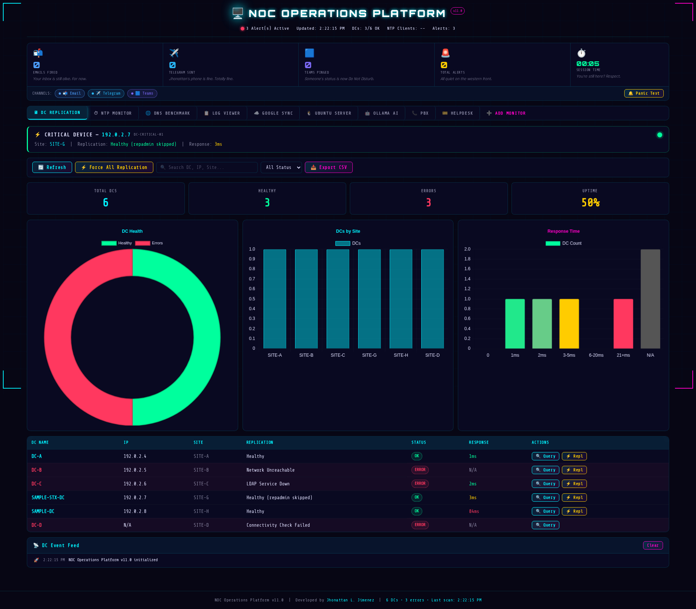
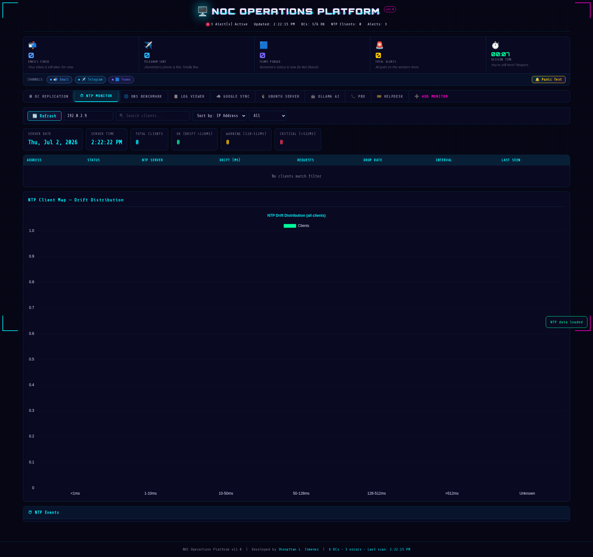
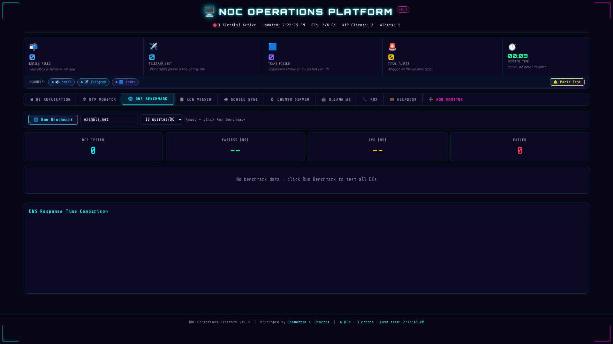
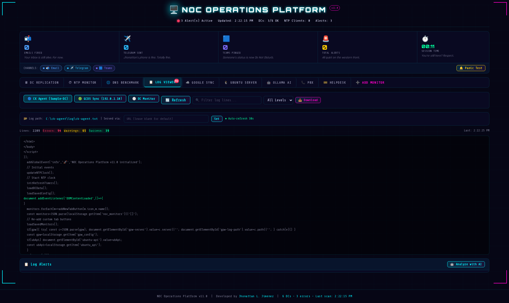
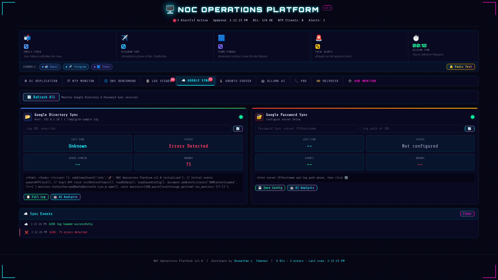
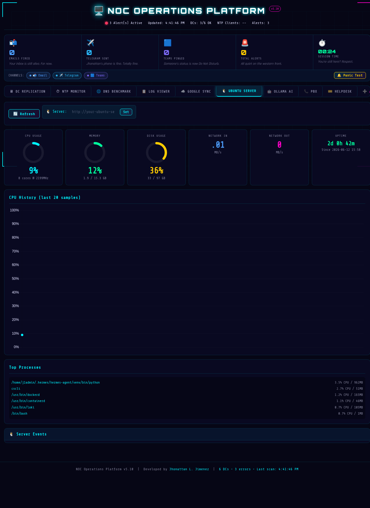
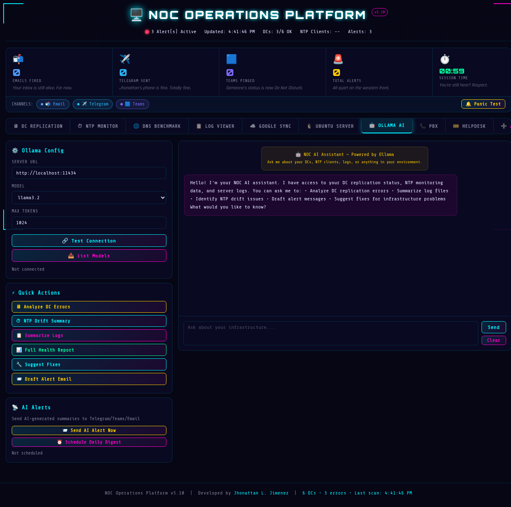
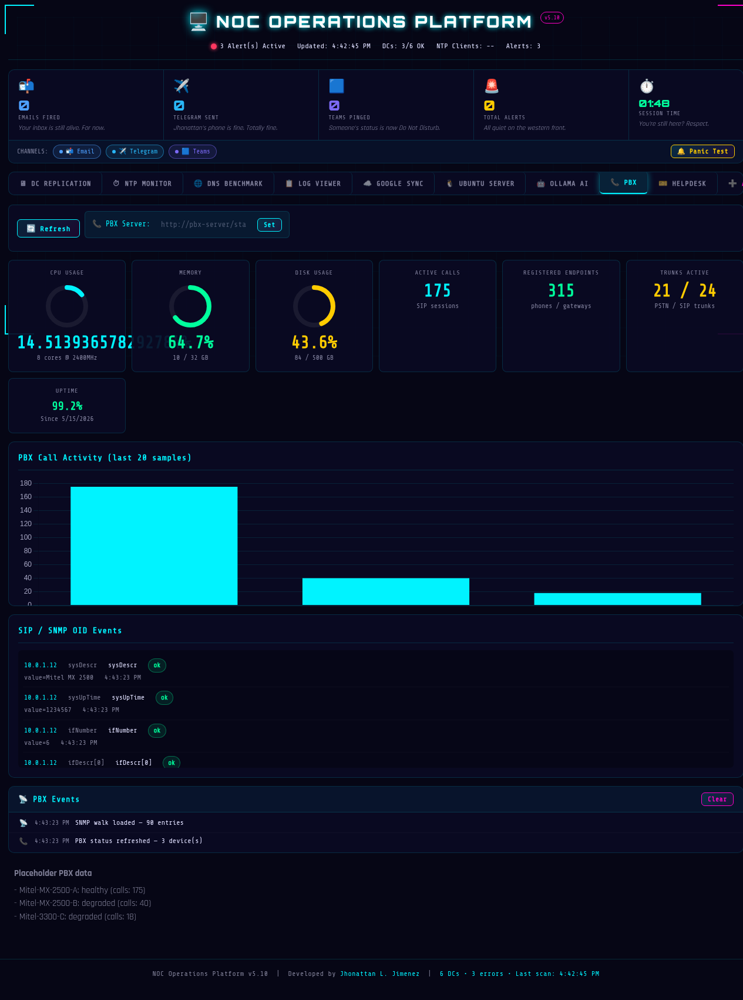
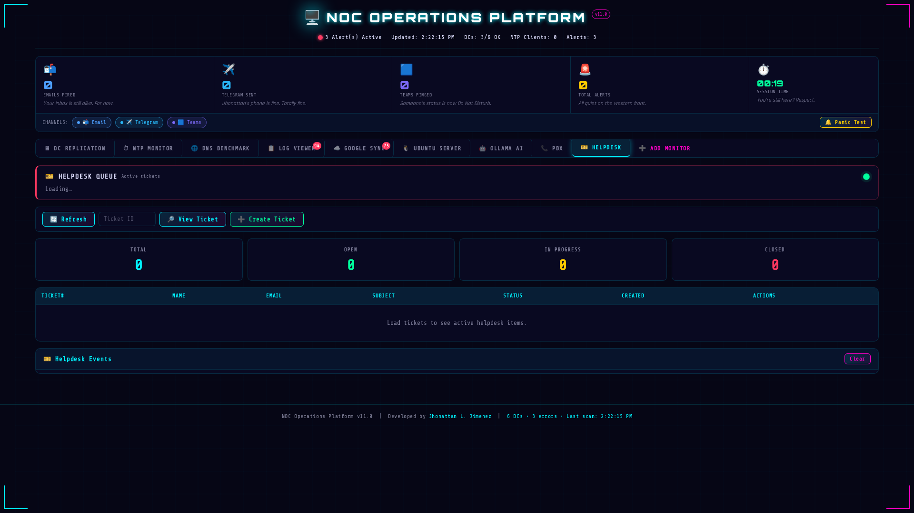

# J1 NOC Operations Platform (JNOP)

**Version:** v5.10  
**Status:** Production Ready  
**Repository:** https://github.com/OneByJorah/J1-NOC-Platform

---

## Table of Contents

- [Overview](#overview)
- [Architecture](#architecture)
- [Technology Stack](#technology-stack)
  - [Frontend](#frontend)
  - [Backend](#backend)
  - [Infrastructure](#infrastructure)
- [Features](#features)
- [Getting Started](#getting-started)
- [Environment Variables](#environment-variables)
- [Service Management](#service-management)
- [CI/CD & Deployment](#cicd--deployment)
- [Security](#security)
- [Project Structure](#project-structure)
- [Screenshots](#screenshots)
- [Contributing](#contributing)
- [License](#license)
- [Author](#author)

---

## Overview

The J1 NOC Operations Platform is an enterprise-grade, dark-themed Network Operations Center dashboard built for real-time infrastructure monitoring, alerting, and operations automation. It consolidates monitoring of Domain Controllers, NTP clients, DNS resolution benchmarks, OS images, logs, and helpdesk tickets into a single reactive interface.

The platform is designed to operate in a self-hosted Linux environment with systemd service management, ensures credentials are never stored in frontend assets (static HTML into `/srv/jnop/app` and `/var/www/noc/`), and supports production traffic directly via Nginx.

---

## Architecture

Client → Nginx (`/etc/nginx/sites-enabled/jnop-dashboard.conf`) → FastAPI backend (`/srv/jnop/app`, port `8000`) → monitoring modules (DC, NTP, DNS, Google, Logs, Ollama, PBX, Helpdesk) → notification channels (Email, Telegram, Teams).

Session identity and long-term memory are handled through **Honcho**; short-term context is handled by the platform runtime. Secrets are loaded via `/srv/jnop/config/` with restrictive `0600` permissions (never co-located with data under `/srv/jnop/data`).

---

## Technology Stack

| Layer | Stack |
|---|---|
| Runtime | Linux (Ubuntu 22.04+/systemd) |
| Backend | Python / FastAPI / Uvicorn |
| Frontend | Static HTML5 Dashboard (Cyberpunk Dark Theme, v5.10) |
| Reverse Proxy | Nginx |
| Process Manager | systemd (`jnop-backend.service`) |
| VCS | Git + GitHub (`github.com/OneByJorah/J1-NOC-Platform`) |
| Memory / Context | Honcho (default provider), disabled on this host |
| Notifications | Email, Telegram, Microsoft Teams |
| Release path | `sudo cp frontend/dist/index.html /var/www/noc/index.html` |

---

## Features

- **DC Replication**: monitor replication health, latency, LDAP and network status.
- **NTP Monitoring**: client drift tracking, thresholds for WARNING/CRITICAL.
- **DNS Benchmark**: per-DC response time aggregation, CSV export.
- **Log Viewer**: unified event timeline across platform modules.
- **Google Sync**: interface for cloud sync status and health indicators.
- **Ubuntu Server**: host-level metrics and kernel event tracking.
- **Ollama AI**: optional AI operations assistant integration.
- **PBX + Helpdesk**: call-path monitoring; ticket lifecycle tracking.
- **Notification channels**: Email / Telegram / Teams events, with per-channel counters and prefixed styling in logs.
- **Panic Test**: one-click synthetic alert generator.
- **Exportable**: CSV export on supported tabs, static frontend artifact (`/var/www/noc/index.html`).

---

## Getting Started

```bash
# 1. Clone the repository
git clone https://github.com/OneByJorah/J1-NOC-Platform.git
cd J1-NOC-Platform

# 2. Backend virtual environment
python3 -m venv /srv/jnop/.venv
source /srv/jnop/.venv/bin/activate
pip install -r requirements.txt

# 3. Environment + config
cp backend/.env.example backend/.env
# Edit backend/.env with your secrets. Keep it out of VCS.
```

---

## Environment Variables

| Variable | Purpose | Notes |
|---|---|---|
| `OPENROUTER_API_KEY` | OpenRouter credential (optional) | Used if gateway/auxiliary models require chat completions |
| `DEEPSEEK_API_KEY`, `XAI_API_KEY`, ... | Provider keys | Optional per enabled integration |
| Frontend: none | `index.html` is credential-free | Do not embed raw secrets in `/var/www/noc/index.html` |

Backend `/srv/jnop/config/` uses file-based configuration with `0600` permissions for sensitive values.

---

## Service Management

```bash
# Start the backend service
sudo systemctl start jnop-backend.service
sudo systemctl enable jnop-backend.service

# Tail logs
sudo journalctl -u jnop-backend.service -f

# Hot-reload frontend without reboot
sudo cp frontend/dist/index.html /var/www/noc/index.html
```

Verify the live frontend size after deploy:

```bash
stat -c "%s %n" /var/www/noc/index.html
# Expect ~production size (do not accept a truncated file)
```

Access the dashboard via your configured reverse proxy / hostname.

---

## CI/CD & Deployment

- Trust system-stored credentials for Git operations.
- No token prompts during deploy flows.
- Docker-hosted Crowdsec requires static DNS entries (`8.8.8.8, 1.1.1.1`) if hub resolution fails.

---

## Security

- Secrets are stored in `gitignored` files (`.env`, `/srv/jnop/config/*` with restrictive permissions).
- The deployed dashboard HTML under `/var/www/noc/` is credential-free.
- `approvals.mode` is set to `manual` by default in Hermes config to prevent unsafe autonomous shell actions; override only when explicitly required.

---

## Project Structure

```
J1-NOC-Platform/
├── frontend/
│   └── dist/
│       └── index.html          # Dashboard build output
└── backend/
    ├── app/                    # FastAPI application
    ├── main.py                 # Service entrypoint
    └── .env.example            # Secrets template
```

---

## Screenshots

All screenshots are live captures from the production instance (as of 2026-06-14 v5.10).

### DC Replication


### NTP Monitor


### DNS Benchmark


### Log Viewer


### Google Sync


### Ubuntu Server


### Ollama AI


### PBX


### Helpdesk


---

## Contributing

1. Create a feature branch off `main`.
2. Ensure no secrets appear in frontend artifacts or README assets.
3. Run existing backend tests before submitting a PR.
4. Post screenshots for new tabs or UI states to `docs/screenshots/`.

---

## License

MIT

---

## Author

Built by **Jhonattan L. Jimenez**.
