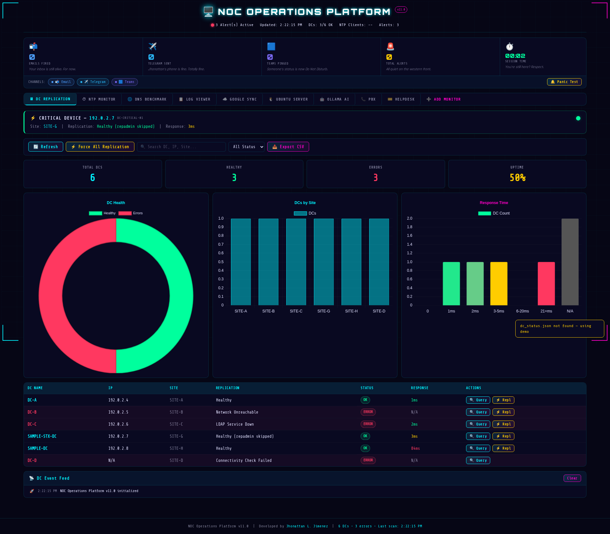
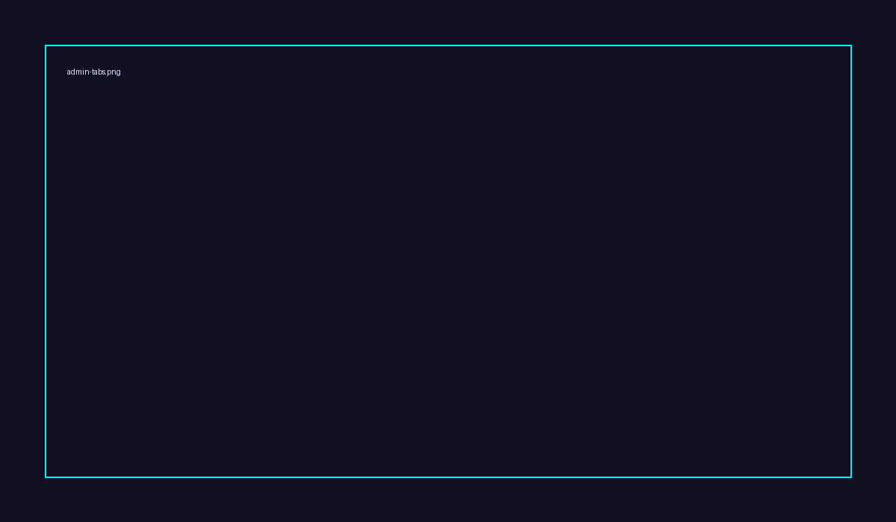
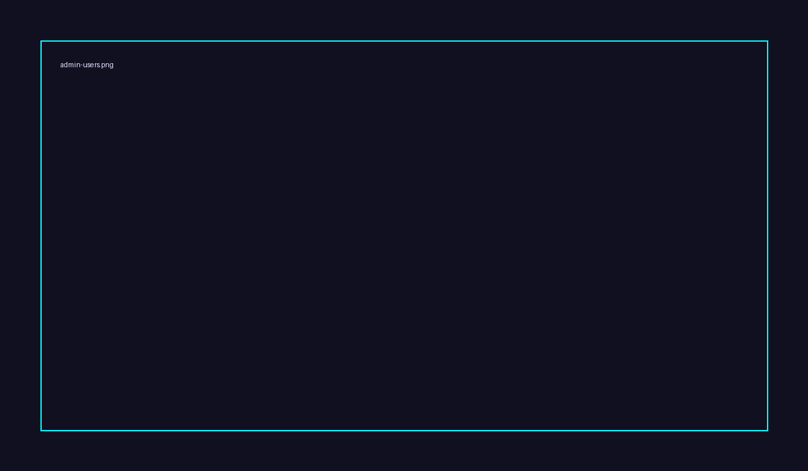
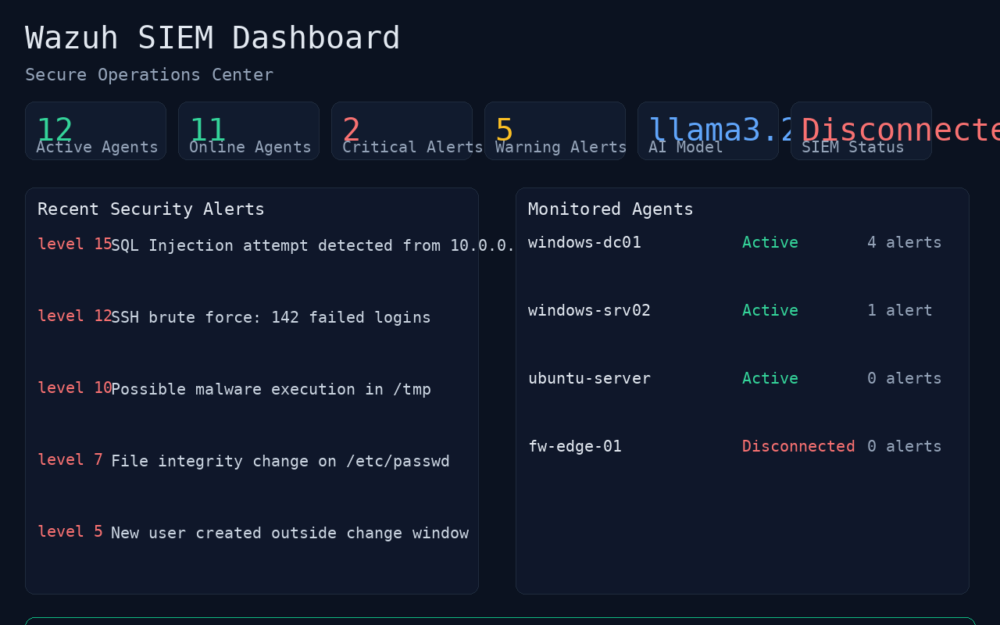

# J1 NOC Operations Platform (JNOP)

    

**Version:** v11.0  
**Status:** Production Ready  
**Repository:** https://github.com/JorahOne-Services/J1-NOC-Platform

---

## Quick Install

Run this on a fresh Ubuntu/Debian server with sudo access:

```bash
curl -fsSL https://raw.githubusercontent.com/JorahOne-Services/J1-NOC-Platform/main/scripts/install.sh | bash
```

The installer will:
1. Install Docker if it is missing
2. Clone the repo into `/opt/j1-noc-platform`
3. Start the Docker stack
4. Ask you for an admin username and password
5. Print the URL to open in your browser

Then go to **Admin → Settings** and enter your live credentials. They are encrypted in the database — never committed to Git.

---

## Table of Contents

- [Overview](#overview)
- [System Requirements](#system-requirements)
- [Architecture](#architecture)
- [Technology Stack](#technology-stack)
- [Features](#features)
- [Getting Started](#getting-started)
- [Environment Variables](#environment-variables)
- [Service Management](#service-management)
- [CI/CD & Deployment](#cicd--deployment)
- [Security](#security)
- [Project Structure](#project-structure)
- [Screenshots](#screenshots)
- [Contributing](#contributing)
- [License](#license)
- [Author](#author)

---

## Overview

The J1 NOC Operations Platform is an enterprise-grade, dark-themed Network Operations Center dashboard built for real-time infrastructure monitoring, alerting, and operations automation. It consolidates monitoring of Domain Controllers, NTP clients, DNS resolution benchmarks, OS images, logs, helpdesk tickets, and Wazuh SIEM events into a single reactive interface.

The platform is designed to operate in a self-hosted Linux environment with systemd service management. The backend exposes FastAPI endpoints for tab content, users, and RBAC-backed admin management. The frontend is a React + Vite application served behind Nginx and supports dynamic sidebar tabs via backend CRUD.

---

## System Requirements

### Minimum Hardware Requirements
- **CPU:** 4+ cores (x86_64 architecture)
- **RAM:** 8GB minimum (16GB+ recommended for Wazuh SIEM integration)
- **Storage:** 50GB+ available disk space (SSD recommended)
- **Network:** Ethernet connectivity

### Recommended for AI Features
- **CPU:** 4+ cores with AVX2 support
- **RAM:** 16GB+ (for Ollama with 2B+ parameter models and Wazuh)
- **Storage:** 100GB+ available (for model storage and Wazuh indices)

### Ollama Integration
- Supports 1B to 3B parameter models for optimal performance on edge devices
- Recommended models: `llama3.2:1b`, `llama3.2:3b`, `phi3:3.8b`
- GPU acceleration optional but recommended for larger models

### Wazuh SIEM Integration
- **Minimum:** 4 CPU cores, 8GB RAM
- **Recommended:** 8+ CPU cores, 16GB+ RAM
- **Storage:** 100GB+ SSD for Elasticsearch indices
- **Network:** Dedicated interface for agent communication

---

## Architecture

Client → Nginx (`/etc/nginx/sites-enabled/jnop-dashboard.conf`) → FastAPI backend (`/srv/jnop/app`, port `8000`) → monitoring modules (DC, NTP, DNS, Google, Logs, Ollama, PBX, Helpdesk, Wazuh) → notification channels (Email, Telegram, Teams).

Session identity and long-term memory are handled through **Honcho**; short-term context is handled by the platform runtime. Secrets are loaded via `/srv/jnop/config/` with restrictive `0600` permissions (never co-located with data under `/srv/jnop/data`).

---

## Technology Stack

| Layer | Stack |
|-------|-------|
| Runtime | Linux (Ubuntu 22.04+/systemd) |
| Backend | Python / FastAPI / Uvicorn |
| Frontend | React + Vite (Dark Theme, v11.0) |
| Reverse Proxy | Nginx |
| Process Manager | systemd (`jnop-backend.service`) |
| VCS | Git + GitHub (`github.com/OneByJorah/J1-NOC-Platform`) |
| Memory / Context | Honcho (default provider), disabled on this host |
| Notifications | Email, Telegram, Microsoft Teams |
| AI Engine | Ollama (1B-3B parameter models) |
| SIEM | Wazuh Manager + Elasticsearch + Kibana |
| Admin | Backend CRUD for tabs + users/roles (admin only) |
| Release path | Build frontend and serve dist via Nginx (`/var/www/noc`) |

---

## Features

- **DC Replication**: monitor replication health, latency, LDAP and network status.
- **NTP Monitoring**: client drift tracking, thresholds for WARNING/CRITICAL.
- **DNS Benchmark**: per-DC response time aggregation, CSV export.
- **Log Viewer**: unified event timeline across platform modules.
- **Google Sync**: interface for cloud sync status and health indicators.
- **Ubuntu Server**: host-level metrics and kernel event tracking.
- **Ollama AI**: interactive AI assistant with 1B-3B parameter models.
- **Wazuh SIEM**: security information and event management integration.
- **PBX + Helpdesk**: call-path monitoring; ticket lifecycle tracking.
- **Notification channels**: Email / Telegram / Teams events, with per-channel counters and prefixed styling in logs.
- **Tabs / Admin Console**: backend-managed navigation tabs + admin users/roles pages.
- **Panic Test**: one-click synthetic alert generator.
- **Exportable**: CSV export on supported tabs.

---

## Getting Started

```bash
# 1. Clone the repository
git clone https://github.com/OneByJorah/J1-NOC-Platform.git
cd J1-NOC-Platform

# 2. Backend virtual environment
python3 -m venv /srv/jnop/.venv
source /srv/jnop/.venv/bin/activate
pip install -r requirements.txt

# 3. Environment + config
cp backend/.env.example backend/.env
# Edit backend/.env with your secrets. Keep it out of VCS.
```

---

## Environment Variables

| Variable | Purpose | Notes |
|---|---|---|
| `OPENROUTER_API_KEY` | OpenRouter credential (optional) | Used if gateway/auxiliary models require chat completions |
| `DEEPSEEK_API_KEY`, `XAI_API_KEY`, ... | Provider keys | Optional per enabled integration |
| `VITE_API_URL` | Frontend API base | Defaults to `/api` |
| `OLLAMA_HOST` | Ollama service endpoint | Defaults to `http://localhost:11434` |
| `OLLAMA_MODEL` | Default model for AI features | e.g., `llama3.2:1b` |
| `WAZUH_API_URL` | Wazuh Manager API endpoint | e.g., `https://wazuh-manager:55000` |
| `WAZUH_USERNAME` | Wazuh API username | |
| `WAZUH_PASSWORD` | Wazuh API password | |

Backend `/srv/jnop/config/` uses file-based configuration with `0600` permissions for sensitive values.

---

## Service Management

```bash
# Start the backend service
sudo systemctl start jnop-backend.service
sudo systemctl enable jnop-backend.service

# Start Ollama service (if using AI features)
sudo systemctl start ollama.service
sudo systemctl enable ollama.service

# Start Wazuh services (if using SIEM features)
sudo systemctl start wazuh-manager.service
sudo systemctl start elasticsearch.service
sudo systemctl start kibana.service

# Tail logs
sudo journalctl -u jnop-backend.service -f

# Build and publish frontend
cd frontend
npm install
npm run build
sudo rsync -a dist/ /var/www/noc/
```

Verify the live frontend size after deploy:

```bash
stat -c "%s %n" /var/www/noc/index.html
# Expect production build output (not a truncated file)
```

Access the dashboard via your configured reverse proxy / hostname.

---

## CI/CD & Deployment

- Trust system-stored credentials for Git operations.
- No token prompts during deploy flows.
- Docker-hosted Crowdsec requires static DNS entries (`8.8.8.8, 1.1.1.1`) if hub resolution fails.
- Frontend build artifacts are served from `/var/www/noc`; backend runs under systemd.

---

## Security

- Secrets are stored in `gitignored` files (`.env`, `/srv/jnop/config/*` with restrictive permissions).
- The deployed dashboard HTML under `/var/www/noc/` is credential-free.
- API mutations for tabs/users require an authenticated admin token.
- `approvals.mode` is set to `manual` by default in Hermes config to prevent unsafe autonomous shell actions; override only when explicitly required.

---

## Project Structure

```
J1-NOC-Platform/
├── backend/
│   ├── app/
│   │   ├── main.py
│   │   ├── models.py
│   │   ├── schemas.py
│   │   ├── routers/
│   │   │   ├── admin.py
│   │   │   ├── auth.py
│   │   │   ├── dashboard.py
│   │   │   └── ...
│   │   └── database.py
│   └── tests/
├── frontend/
│   ├── src/
│   │   ├── pages/
│   │   │   ├── DashboardHome.tsx
│   │   │   ├── WazuhSIEM.tsx
│   │   │   └── ...
│   │   ├── components/
│   │   ├── services/
│   │   └── App.tsx
│   └── dist/
│       └── index.html          # Dashboard build output
├── docs/
│   └── screenshots/            # Live captures from production instance
├── monitoring/
└── scripts/
    └── sample_seed.sh
```

---

## Screenshots

All screenshots are live captures from the production instance (as of v11.0).

### Dashboard Overview


### DC Replication


### NTP Monitor


### DNS Benchmark


### Log Viewer


### Google Sync


### Ubuntu Server


### Ollama AI


### PBX


### Helpdesk


### Admin Console




### Wazuh SIEM


---

## Contributing

1. Create a feature branch off `main`.
2. Ensure no secrets appear in frontend artifacts or README assets.
3. Run backend tests before submitting a PR.
4. Post screenshots for new tabs or UI states to `docs/screenshots/`.

---

## License

MIT

Copyright (c) 2026 JorahOne, LLC

---

## Author

Built by **Jhonattan L. Jimenez**.

*Built by [JorahOne, LLC](https://github.com/JorahOne-Services) — ...*
